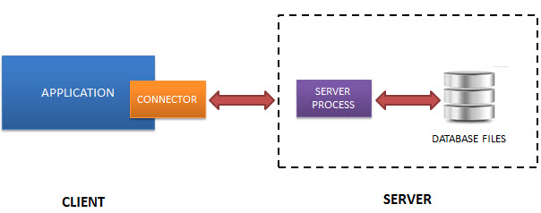

# SQLite

O SQLite é uma biblioteca de software escrita em C que implementa um Sistema Gerenciador de Banco de Dados (SGBD):

- relacional
- lightweight
- autocontido
- zero configuração
- serverless
- transacional

> Existem implementações do SQLite para muitas e muitas linguagens, inclusive Javascript. Não precisamos usar C para usar SQLite.

Uma das características do SQLite que mais nos interessa neste curso é a de ser `serverless`.

Outros SGBDs precisam de um programa servidor para trabalhar (e consequentemente um cliente para acessar as bases de dados).

Essa é uma arquitetura chamada `cliente-servidor`.

O diagrama abaixo ilustra essa arquitetura

O SQLite não tem um servidor. Ele acessa o banco de dados diretamente do sistema de arquivos, localmente na máquina.

Essa arquitetura nos interessa porque neste curso vamos justamente aprender a criar um servidor. Assim poderemos criar nós mesmos esse servidor do banco de dados, para ser acessado por clientes através da rede.

## Referências

- https://www.sqlite.org – Homepage do SQLite
- https://www.sqlite.org/features.html – Características
- https://www.sqlite.org/copyright.html – Licença (Domínio Público)
- https://www.sqlite.org/docs.html – Documentação
